---?color=white
<span style="font-size:1.5em; font-weight: bold;">Building GUI Architecture with LiveData, ViewModel and Lifecycle</span>

</br></br>

@div[left-40]
@divend

@div[right-60]
<span style="font-size:0.6em;">Aleksey Ivanovskiy</span>
</br>
<span style="font-size:0.6em;">Android Developer at SolarWinds</span>
@divend
---

<span style="font-size:1.5em; font-weight: bold;">GUI Architecture Patterns</span>

- Model-View-Controller
- Model-View-Presenter
- Model-View-ViewModel

---

> “Different people reading about MVC in different places take different ideas from it and describe these as 'MVC'."

<span style="font-size:0.6em; font-weight: bold;">Martin Fowler</span>

---

<span style="font-size:1.5em; font-weight: bold;">MVP</span>

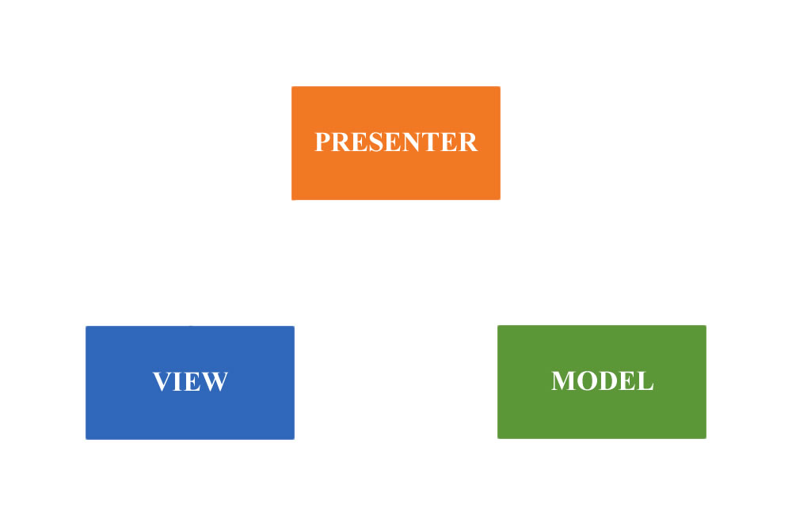

+++

<span style="font-size:1.5em; font-weight: bold;">MVP</span>

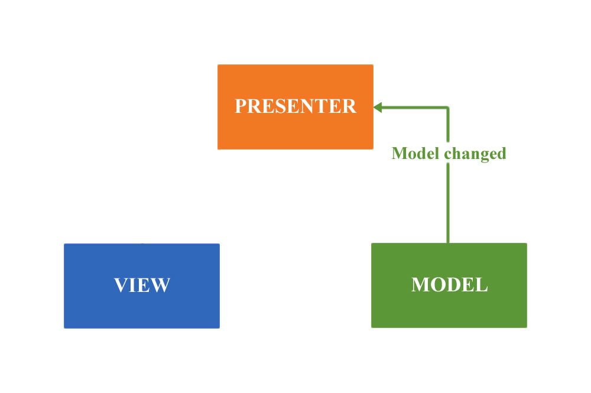

+++

<span style="font-size:1.5em; font-weight: bold;">MVP</span>

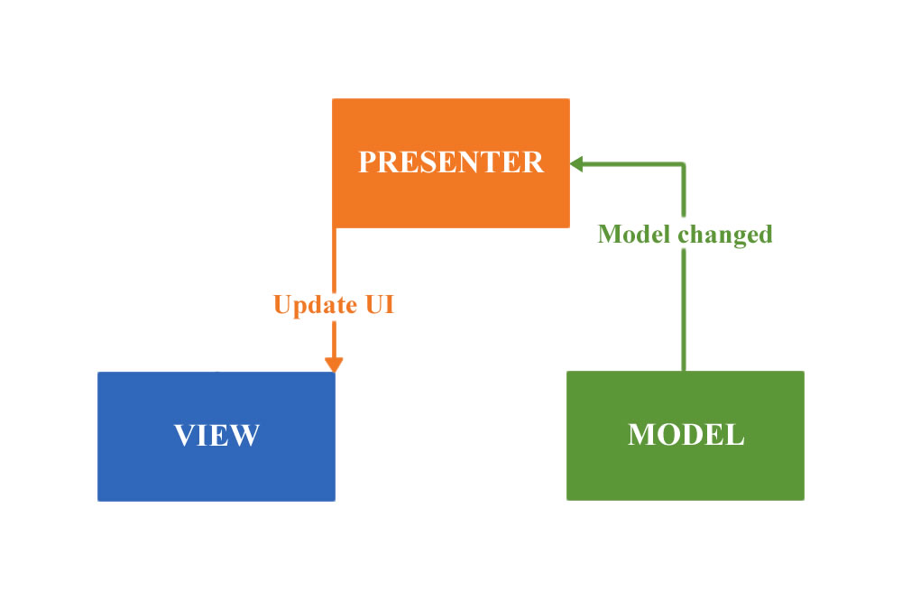

+++

<span style="font-size:1.5em; font-weight: bold;">MVP</span>

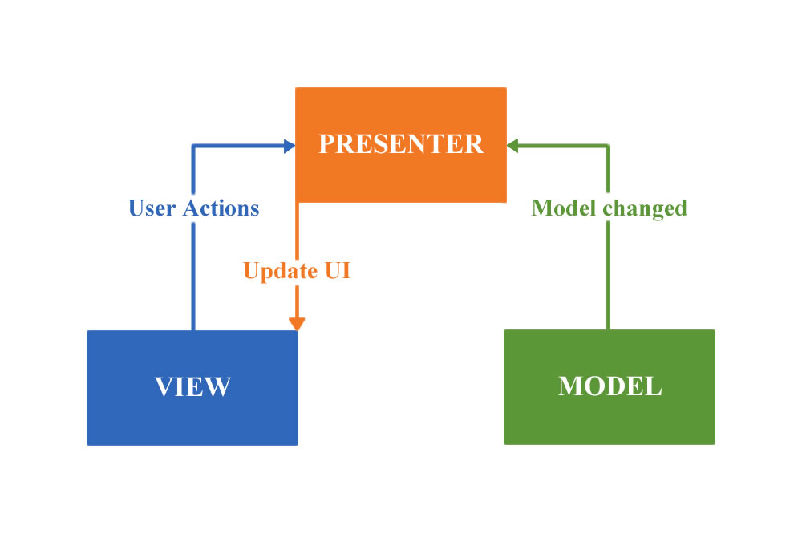

+++

<span style="font-size:1.5em; font-weight: bold;">MVP</span>

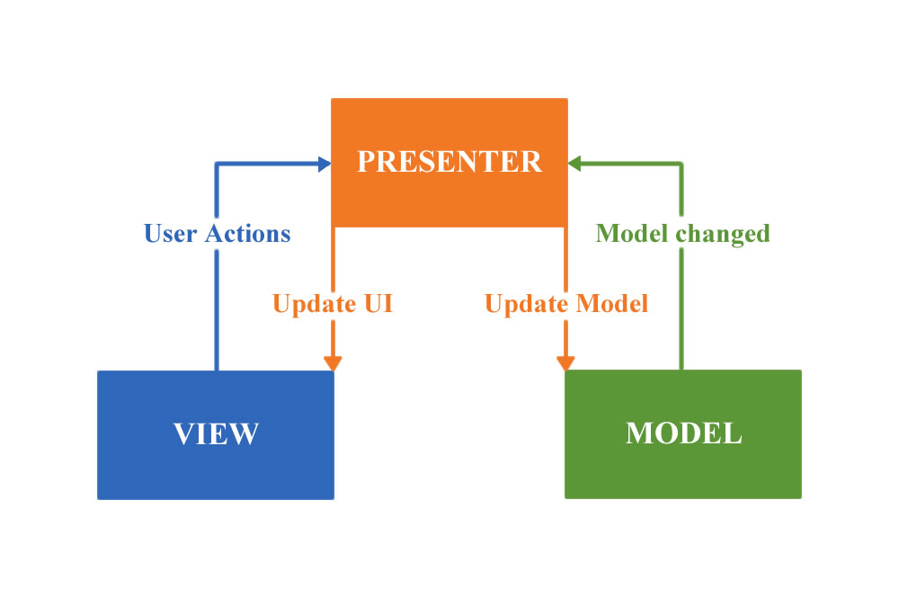

+++

<span style="font-size:1.5em; font-weight: bold;">MVP</span>

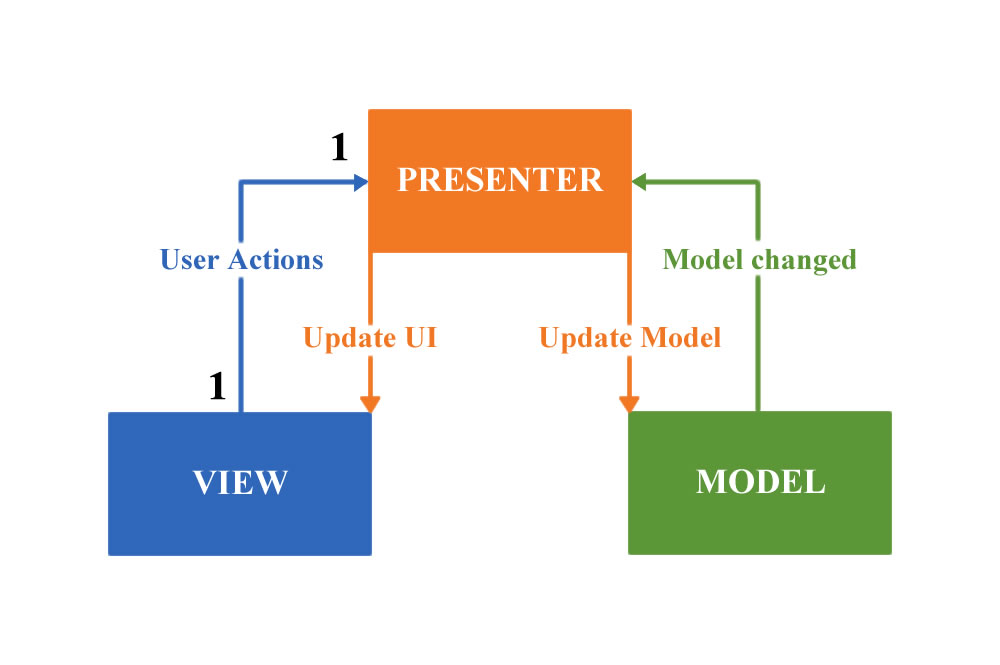

---

<span style="font-size:1.5em; font-weight: bold;">MVVM</span>


+++

<span style="font-size:1.5em; font-weight: bold;">MVVM</span>


+++

<span style="font-size:1.5em; font-weight: bold;">MVVM</span>

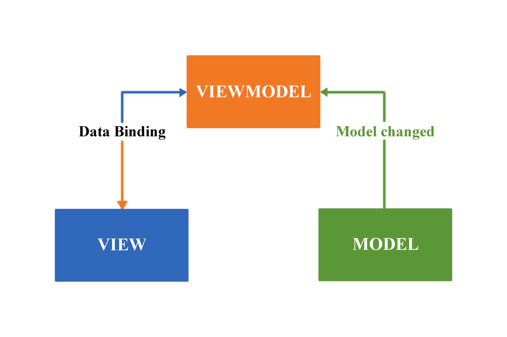

+++

<span style="font-size:1.5em; font-weight: bold;">MVVM</span>

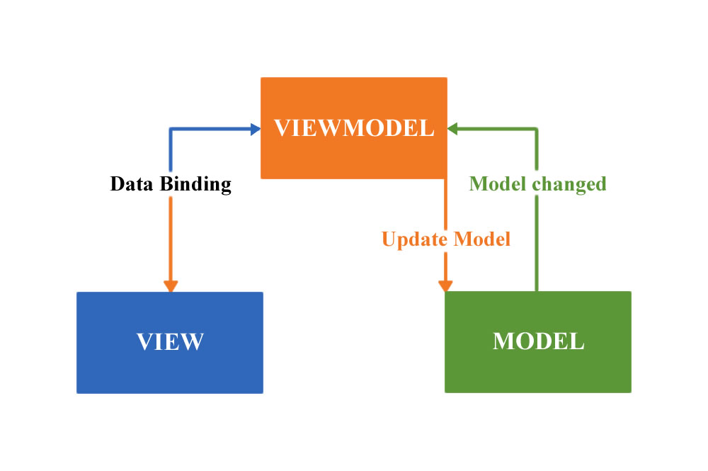

+++

<span style="font-size:1.5em; font-weight: bold;">MVVM</span>

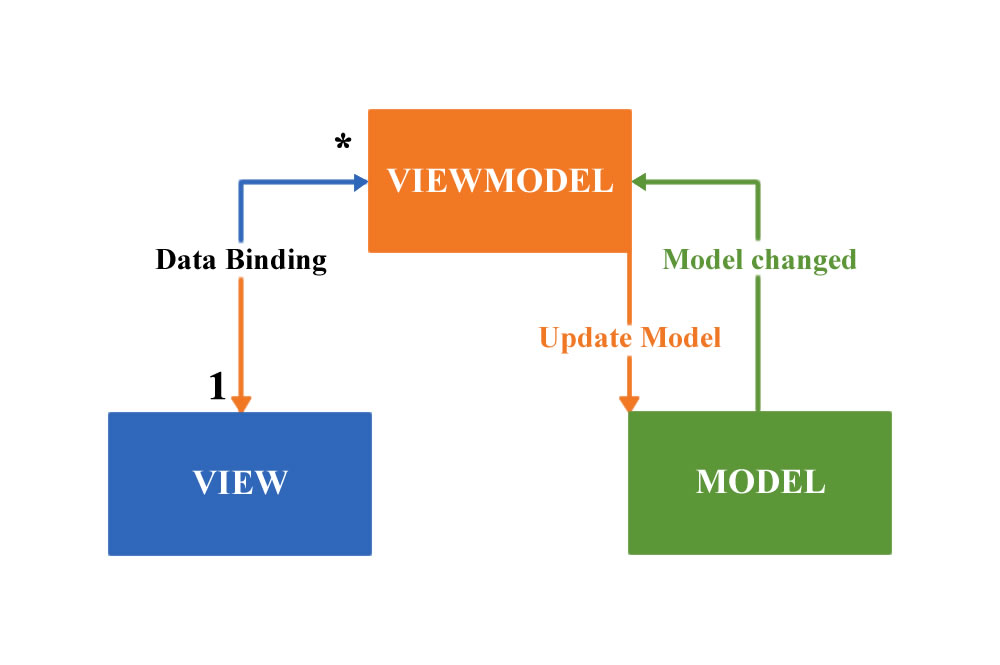

---

<span style="font-size:1.5em; font-weight: bold;">What was before Architecture Components?</span>

@ul
- No official guide for application architecture
  - <span style="font-size:0.7em">Activities & Views</span>
  - <span style="font-size:0.7em">Activities & Views & Fragments & Loaders (since Android 3.0)</span>
  - <span style="font-size:0.7em">Architecture Components Alpha (17 May 2017, Android 7.1) and "Guide to App Architecture"</span>
- 3-rd party frameworks (Mosby, Moxy and etc.)
@ulend

---

<span style="font-size:1.5em; font-weight: bold;">Architecture Components Libraries</span>

- Lifecycle-Aware Components
- LiveData
- ViewModel
- <span style="color:gray;">Data Binding</span>
- <span style="color:gray;">Paging</span>
- <span style="color:gray;">Room</span>
- <span style="color:gray;">WorkManager</span>
- <span style="color:gray;">Navigation</span>

---

<span style="font-size:1.5em; font-weight: bold;">Lifecycle-Aware Components</span>

- Allows easily bound object to Activity/Fragment lifecycle
- Reduce the amount of code in Activity/Fragment
- Helps avoid memory leaks and crashes
- Already in support library.

---

<span style="font-size:1.5em; font-weight: bold;">Main Classes & Interfaces</span>

- Lifecycle
- enums Lifecycle.State and Lifecycle.Event
- interface LifecycleObserver
- annotation OnLifecycleEvent
- interface LifecycleOwner

---

<span style="font-size:1.5em; font-weight: bold;">Lifecycle <span style="color:#B399FF;">States</span> and <span style="color:#FFC926;">Events</span></span>

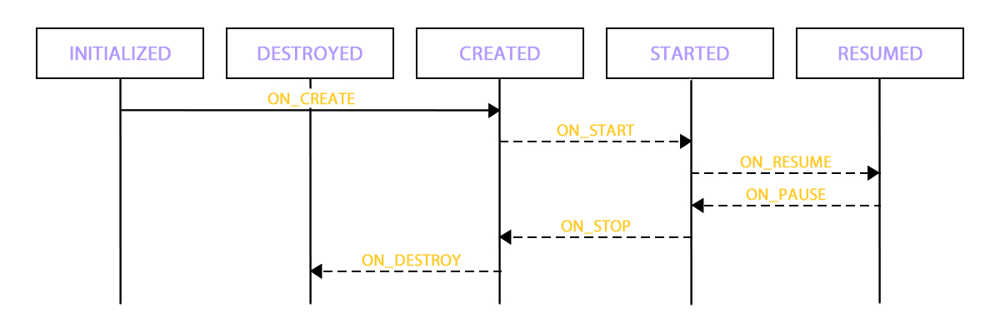

---?code=assets/code/sensor/SensorListener.java&lang=java&title=<span style="font-size:1.5em;">**Handling Lifecycle example**</span>
@[12-14]()
@[29-33]()
@[35-38]()
@[40-45]()
@[23-27]()

---?code=assets/code/sensor/SensorListenerActivity.java&lang=java&title=<span style="font-size:1.5em;">**Handling Lifecycle example**</span>
@[13-15]()

---

<span style="font-size:1.5em; font-weight: bold;">LiveData&lt;T&gt;</span>

- Observable data holder class
- Bound to lifecycle
- Notify the observer if its lifecycle in **State.STARTED** or **State.RESUMED** state
- Holds and store only the last value

---

<span style="font-size:1.5em; font-weight: bold;">LiveData example</span>

```java
MutableLiveData<String> data = ...;

data.observe(this, new Observer<String>() {
    @Override
    public void onChanged(@Nullable String item) {
        //handle item in UI
    }
});

data.observe(this, item -> {
    //handle item in UI
});

//set new value and notify observers
//from main thread
data.setValue("First value");

new Thread(() -> {
    //set new value from background thread
    data.postValue("Second value");
}).start();
```
@[1]()
@[3-8](First argument is LifecycleOwner)
@[10-12](First argument - LifecycleOwner; second argument - observer)
@[14-16]()
@[18-21]()

---

<span style="font-size:1.5em; font-weight: bold;">LiveData advantages</span>

- No more IllegalStateException due to stopped activities
- No more manual lifecycle handling
- Thread-Safety

---

<span style="font-size:1.5em; font-weight: bold;">Main Classes & Interfaces</span>
- LiveData
- MutableLiveData
- MediatorLiveData
- Transformations
  - <span style="font-size:0.7em;">**map()** - map value to a new object</span>
  - <span style="font-size:0.7em;">**switchMap()** - map value to a new LiveData</span>

---

<span style="font-size:1.5em; font-weight: bold;">MediatorLiveData example</span>

```java
LiveData<String> firstData = ...;
LiveData<String> secondData = ...;

MediatorLiveData<String> mergedData = new MediatorLiveData<>();

mergedData.addSource(firstData,
        value -> mergedData.setValue(value));

mergedData.addSource(secondData,
        value -> mergedData.setValue(value));

mergedData.observe(this, value -> {
    //handle in UI
});
```
@[1-2]()
@[4]()
@[6-7]()
@[9-10]()
@[12-14]()

---

<span style="font-size:1.5em; font-weight: bold;">LiveData Transformations example</span>

```java
LiveData<Long> idData = ...;

LiveData<String> convertedData = Transformations.map(idData,
        id -> String.valueOf(id));

LiveData<Item> swConvertedData = Transformations.switchMap(idData,
        id -> repository.getItem(id));
```
@[1](Just a regular LiveData with ID)
@[3,4](Convert LiveData with ID to LiveData with String)
@[6,7]()

---

<span style="font-size:1.5em; font-weight: bold;">ViewModel</span>
- Holds all UI data (like VM in MVVM)
- No reference to Activity/Fragment/View
- Allows data to survive configuration changes
  - <span style="font-size:0.7em;">**Not in case if App was killed by system from background state**</span>

---
<span style="font-size:1.5em; font-weight: bold;">Saving state</span>

- Store ID in **onSaveInstanceState()** method
- Lookup data by ID and load it

---
<span style="font-size:1.5em; font-weight: bold;">ViewModel lifecycle</span>

@div[left-50]
- onCleared()
@divend

@div[right-50]
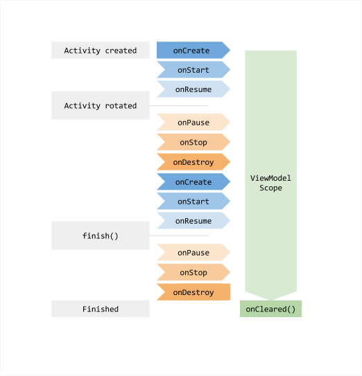
@divend

---

<span style="font-size:1.5em; font-weight: bold;">Main Classes & Interfaces</span>

- ViewModel
- AndroidViewModel
- interface ViewModelProvider.Factory
- ViewModelProvider
- ViewModelProviders

---?code=assets/code/viewmodel/ItemsViewModel.java&lang=java&title=<span style="font-size:1.5em;">**ViewModel example**</span>
@[9]()
@[11]()
@[13-19]()
@[16]()
@[21-23]()

---?code=assets/code/viewmodel/MainActivity.java&lang=java&title=<span style="font-size:1.5em;">**ViewModel example**</span>
@[14-15]()
@[17-19]()

---

<span style="font-size:1.5em; font-weight: bold;">Android Architecture Blueprints</span>

@div[left-50]
Simple To-Do list app
@divend

@div[right-50]

@divend

---

<span style="font-size:1.5em; font-weight: bold;">To-Do App</span>
<br>
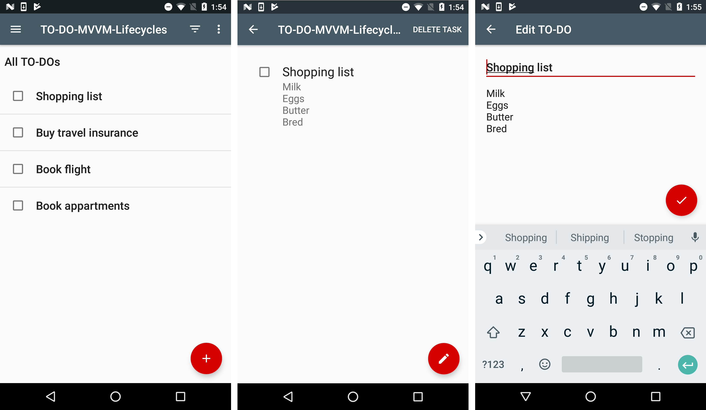

---?code=assets/code/to-do-app/TasksActivity.java&lang=java&title=<span style="font-size:1.5em;">**TasksActivity.java**</span>
@[41]()
@[50-56](Setup layout,  ToolBar, NavigationDrawer and TasksFragment)
@[58](Get instance of TasksViewModel)
@[79-87]()
@[60-68](Get LiveData for "Open Task" event and observe it)
@[70-76](Get LiveData for "New Task" event and observe it)

---?code=assets/code/to-do-app/SingleLiveEvent.java&lang=java&title=<span style="font-size:1.5em;">**SingleLiveEvent.java**</span>
@[38](Extends MutableLiveData)
@[42](AtomicBoolean to avoid recall)
@[44-61](Method observe() is overrode)
@[51-59](Observer is wrapped with internal observer)
@[55-56](If mPending is set to true, set it to false and call original observer)
@[62-66](Set true to mPending)
@[71-74](Method to initiate event)

---?code=assets/code/to-do-app/TasksFragment.java&lang=java&title=<span style="font-size:1.5em;">**TasksFragment.java**</span>
@[46]()
@[68-81]()
@[72](Inflate view)
@[74-76](Bind View to ViewModel)
@[117-124](Snackbar binding)
@[83-97](Menu processing, not all click events are processing with SingleLiveEvent)
@[62-66](Notify ViewModel it can load tasks)

---?code=assets/code/to-do-app/TasksViewModel.java&lang=java&title=<span style="font-size:1.5em;">**TasksViewModel.java**</span>
@[50]()
@[52-63]()
@[65-75]()
@[92-94](Call method which will load tasks)
@[196](Load tasks from repository)
@[205-207](Filtering items in main thread)
@[241-244](Error handling)

---?code=assets/code/to-do-app/TasksAdapter.java&lang=java&title=<span style="font-size:1.5em;">**TasksAdapter.java**</span>
@[78-89](Notify ViewModel about "Complete Task" and "Open task" events)

---

<span style="font-size:1.5em; font-weight: bold;">Problems & Summary</span>

```java
public interface TasksNavigator {
    void addNewTask();
}

public class TasksActivity extends AppCompatActivity implements 
    TaskItemNavigator,
    TasksNavigator {
    
    @Override
    protected void onCreate(Bundle savedInstanceState) {
        super.onCreate(savedInstanceState);

        //...

        mViewModel.getNewTaskEvent().observe(this, new Observer<Void>() {
            @Override
            public void onChanged(@Nullable Void _) {
                addNewTask();
            }
        });
    }
}
```
---

<span style="font-size:1.5em; font-weight: bold;">Problems & Summary</span>

- Useless interface **TasksNavigator**
- Some input events are handled with SingleLiveEvent, some are not
- Databinding in some cases can produce XML with complex logic
- Too much boolean flags in ViewModel (such as error, empty and loading)
- Repository callbacks in main thread

---

<span style="font-size:1.5em; font-weight: bold;">Solution</span>

- LiveData as fields in ViewModel
- Wrapper class for describing view state (loading, empty, errors)
- DI instead of Factory for ViewModels
- RxJava

---

<span style="font-size:1.5em; font-weight: bold;">Tasty Meals App</span>
<br>
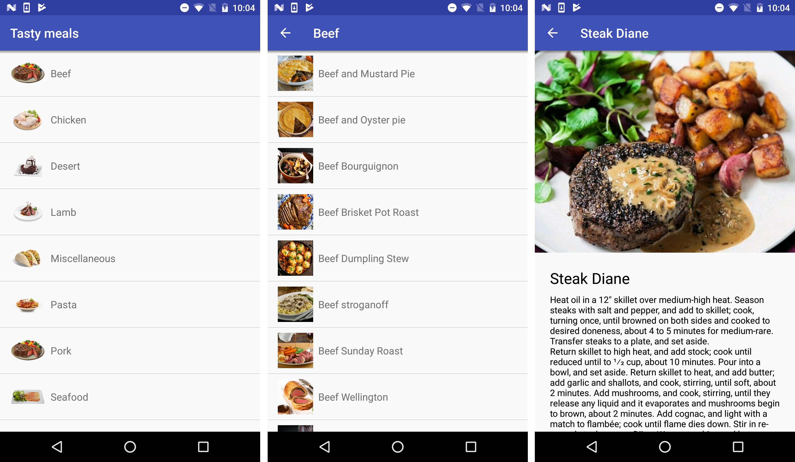

---

<span style="font-size:1.5em; font-weight: bold;">Project structure</span>
<br>
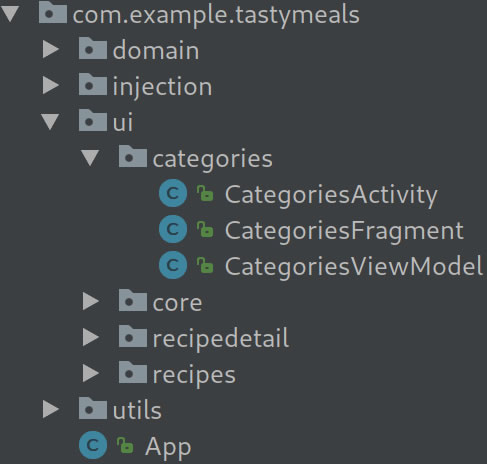

---?code=assets/code/tasty-meals-app/ViewState.java&lang=java&title=<span style="font-size:1.5em;">**ViewState.java**</span>

---?code=assets/code/tasty-meals-app/CategoriesViewModel.java&lang=java&title=<span style="font-size:1.5em;">**CategoriesViewModel.java**</span>
@[26](Extends AndroidViewModel because it has context)
@[31-36](Declare fields which will repressent data and View state)
@[42-47](Intialize LiveData objects)
@[70-72](Method which will initiate data loading)
@[74-86](Load data from repository)
@[83](Callback method for data)
@[88](Resource is just wrapper for data objects)
@[89]()
@[91-99](Display recipe categories or empty state)
@[99-108](Display error or categories with error)

---?code=assets/code/tasty-meals-app/CategoriesFragment.java&lang=java&title=<span style="font-size:1.5em;">**CategoriesFragment.java**</span>
@[22](Extends BaseFragment which knows about ViewState)
@[41](Inflate view)
@[46-54](Configure RecyclerView)
@[56](Obtain instance of CategoriesViewModel)
@[58-62](Bind fields)
@[69-73](Set categories data to adapter)
@[85-87]()
@[32-36](Notify ViewModel it can load data)

---?code=assets/code/tasty-meals-app/CategoriesActivity.java&lang=java&title=<span style="font-size:1.5em;">**CategoriesActivity.java**</span>
@[10]()
@[16-22](Set content view, setup ActionBar, setup CategoriesFragment)

--- 

<span style="font-size:1.5em; font-weight: bold;">Summary</span>

- Interaction with Activity/Fragment lifecycle is a little bit easier
- Officially supported by Google
- You can use LiveData with other architecture pattern (for example with MVP)

---

<span style="font-size:2.0em; font-weight: bold;">Thanks!</span>

---

<span style="font-size:2.0em; font-weight: bold;">Questions?</span>
</br>
- 'GUI Architects' by Martin Fowler
  - <span style="font-size:0.7em;">https://martinfowler.com/eaaDev/uiArchs.html</span>
- Android Architecture Blueprints
  - <span style="font-size:0.7em;">https://github.com/googlesamples/android-architecture</span>
- Presentation
  - <span style="font-size:0.7em;">https://github.com/aivanovski/gdg-meetup-presentation</span>
- Tasty Meals App
  - <span style="font-size:0.7em;">https://github.com/aivanovski/gdg-meetup-sample</span>